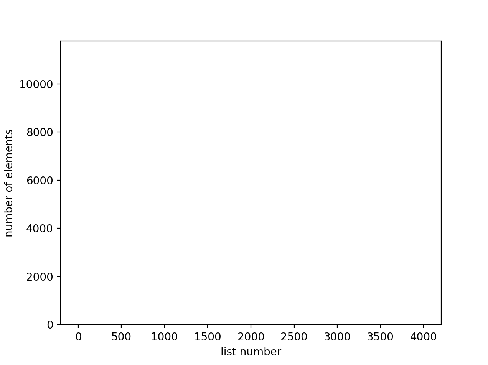
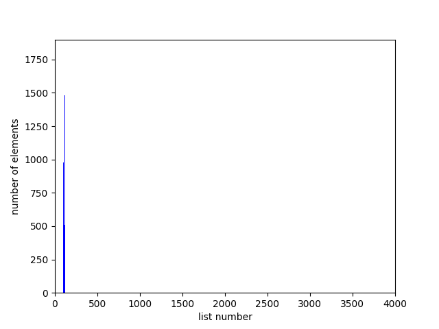
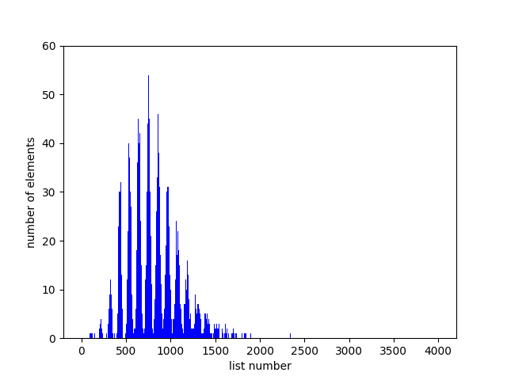
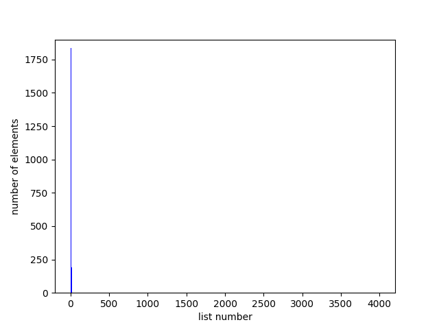
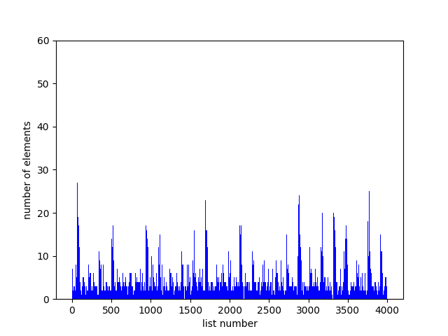
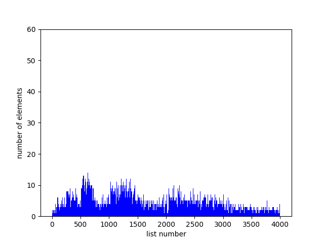
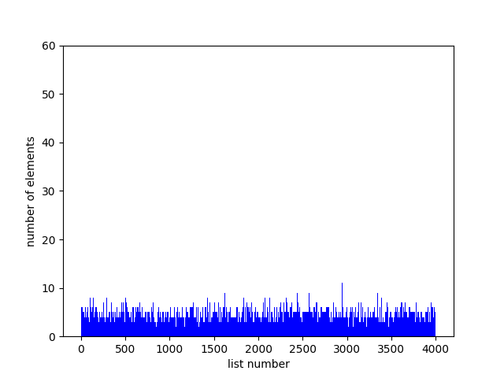

1. Хэш-функция, которая всегда возвращает 1

2. Хэш-функция, которая возвращает ASCII-код первого символа слова

3. Хэш-функция, которая возвращает сумму ASCII-кодов элементов слова

4. Хэш-функция, которая возвращает размер строки

5. Хеш-функция Rol

6. Хеш-функция Lol

7. Хэш-функция Crc32

|         Хэш-функция           |  Дисперсия |
|:-----------------------------:|:----------:|
| всегда возвращает 1           |    31412   |
| ASCII-код первой буквы        |    1923    |
| сумма ASCII-кодов букв слова  |     55     |
| длина слова                   |    3679    |
| rol                           |     12     |
| lol                           |      5     |
| CRC32                         |      3     |
