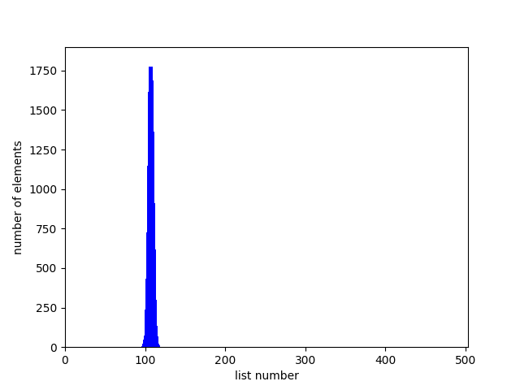
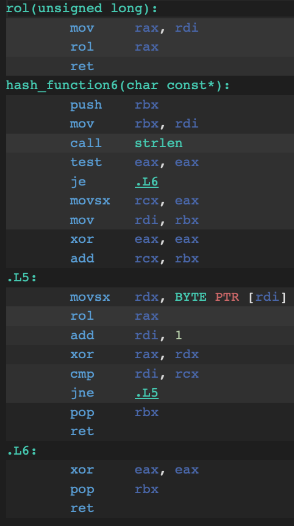
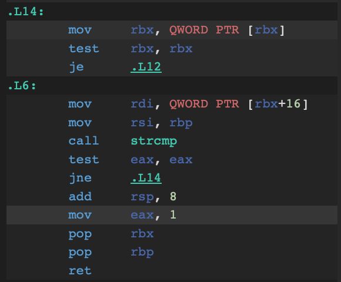

# Хэш-таблица
Тестирование и оптимизация различных версий хэш-функций.

## Содержание

1. [Часть первая](#часть-первая-сравнение-хэш-функций)
    1. [Цель](#цель)
    2. [Реализованные хэш-функции](#реализованные-хэш-функции)
    3. [Эксперимент](#эксперимент)
       1. [Хэш-функция, которая всегда возвращает 1](#1-хэш-функция-которая-квсегда-возвращает-1)
       2. [Хэш-функция, которая возвращает ASCII-код первого символа слова](#2-хэш-функция-которая-возвращает-ascii-код-первого-символа-слова)
       3. [Хэш-функция, которая возвращает сумму ASCII-кодов элементов слова](#3-хэш-функция-которая-возвращает-сумму-ascii-кодов-элементов-слова)
       4. [Хэш-функция, которая возвращает длину слова](#4-хэш-функция-которая-возвращает-длину-слова)
       5. [Хеш-функция Ror](#5-хеш-функция-ror)
       6. [Хеш-функция Rol](#6-хеш-функция-rol)
       7. [Хэш-функция Crc32](#7-хэш-функция-crc32)
    4. [Анализ дисперсий хэш-функций](#анализ-дисперсий-хэш-функций)
    5. [Формула для расчета дисперсии](#формула-для-расчета-дисперсии)
    6. [Результаты](#результаты)
    7. [Вывод](#Вывод)
2. [Часть вторая](#часть-вторая)
   1. [Цель](#Цель)
   2. [Эксперимент](#Эксперимент)
        1. [Способы улучшения производительности программы](#способы-улучшения-производительности-программы)
        2. [Изначальная реализация](#изначальная-реализация)
        3. [Оптимизация хэш-функции](#оптимизация-хэш-функции)
        4. [Оптимизация strcmp](#оптимизация-strcmp)
        5. [Оптимизация HT_Find](#оптимизация-ht_find)
        6. [Увеличение размера хэш-таблицы](#увеличение-размера-хэш-таблицы)
        7. [Анализ оптимизаций](#анализ-оптимизаций)
3. [Примечание](#примечание)

## Часть первая. Сравнение хэш-функций

#### Цель

Целью данной части является выяснение, как часто происходят коллизии хэша для разных хэш-функций на основе анализа размеров цепочек в хеш-таблице.

Визуализация хэш-таблицы методом цепочек:


#### Входные данные

Используемые входные данные представляют собой произведение "Мастер и Маргарита" Михаила Булгакова, переведенное на английский. Перед использованием текст обрабатывается следующим образом:

- Удаляются знаки препинания;
- Удаляются цифры;
- Буквы приводятся к нижнему регистру.

#### Реализованные хэш-функции

Программа сравнивает семь различных хэш-функций:

1. Возвращает всегда 1;
2. Возвращает сумму ASCII-кодов первого символа строки;
3. Возвращает сумму ASCII-кодов всех символов строки;
4. Возвращает размер слова;
5. Функция хеширования LOL;
6. Функция хеширования ROR;
7. Хэш-функция Crc32.


#### Эксперимент

Для каждой хэш-функции создается хеш-таблица методом цепочек с константным размером 4001. Затем каждое слово из произведения добавляется в хэш-таблицу. В случае коллизии элементы перечисляются в цепочке. Размер каждой цепочки записывается.

#### 1. Хэш-функция, которая всегда возвращает 1

```cpp
key_type hash_func1(const char* key) {
    return 1;
}
```


Эта хэш-функция неэффективна, так как все элементы складываются в один список.

#### 2. Хэш-функция, которая возвращает ASCII-код первого символа слова

```cpp
key_type hash_func2(const char* key) {
    return key[0];
}
```


В увеличенном масштабе:


Эта функция не подходит для эффективного использования хеш-таблицы, так как коллизии происходят слишком часто. Значения хеш-функции не распределены равномерно.

#### 3. Хэш-функция, которая возвращает сумму ASCII-кодов элементов слова

```cpp
key_type hash_func3(const char* key) {
    size_t len = strlen(key);
    size_t sum_ASCII_code = 0;

    for (size_t i = 0; i < len; i++) {
        sum_ASCII_code += (int)key[i];
    }

    return sum_ASCII_code;
}
```


Хэш-функция, основанная на сумме ASCII-кодов элементов слова, проявляет распределение с множеством пиков. Это происходит потому, что каждая буква в слове имеет свой уникальный ASCII-код, и сумма этих кодов зависит от длины слова и порядка букв в нем.

Результаты хэш-функции на размере хэш-таблицы 503


Уменьшая размер хэш-таблицы до 503 получается наложение значений длины списков с 503 до ~1200 на значения от 0 до 502.

#### 4. Хэш-функция, которая возвращает длину слова

```cpp
key_type hash_func4(const char* key) {
    return strlen(key);
}
```


В увеличенном масштабе:


Из данного анализа графика можно сделать вывод, что слова определенных длин встречаются чаще всего. Например, слова длиной 2-10 символов имеют более высокую частоту появления по сравнению со словами другой длины. Однако, с увеличением длины слова количество таких слов снижается, и слова длиной более 15 символов уже становятся редкостью.

Такой подход делает хеш-таблицу менее эффективной, поскольку большинство слов будут хэшироваться в ограниченный диапазон индексов таблицы.

К дополнению рассмотрим хэш-функцию, которая возвращает сумму ASCII-кодов элементов слова деленное на длину слова:

```cpp
key_type hash_func4_2(const char* key) {
    size_t len = strlen(key);
    if (len == 0) {
        return 1;
    }

    size_t sum_ASCII_code = 0;
    for (size_t i = 0; i < len; i++) {
        sum_ASCII_code += (int)key[i];
    }

    return (int)(sum_ASCII_code / len);
}
```


В увеличенном масштабе:



Можно заметить, что все значения хешей в диапазоне 90-120. Такое распределение значений хешей указывает на то, что большинство слов имеют близкие значения хешей, что может привести к увеличению количества коллизий.

#### 5. Хеш-функция ROR

Хэш-функция ROR осуществляет циклический сдвиг битов числа вправо. Биты сдвигаются вправо, и биты, выходящие за пределы справа, перемещаются на место самых младших битов числа.

```cpp
inline size_t ror(size_t x) {
    return (x >> 1) | (x << 63);
}

key_type hash_function5(const char* key) {
    size_t ans = 0;

    for (size_t i = 0; key[i] != '\0'; i++) {
        ans = ror(ans) ^ (key[i]);
    }

    return ans;
}
```


Эта хэш-функция обеспечивает более равномерное распределение данных в диапазоне от 0 до 4001 с максимальными пиками, достигающими 27. Это означает, что значения хэш-кодов, возвращаемые этой функцией, имеют более однородное распределение по всему диапазону значений от 0 до 4001.

#### 6. Хеш-функция LOL

Хэш-функция LOL представляет собой алгоритм хэширования, который осуществляет циклический сдвиг битов числа влево.

```cpp
inline size_t rol(size_t x) {
    return (x << 1) | (x >> 63);
}

key_type hash_function6(const char* key) {
    size_t ans = 0;

    ffor (size_t i = 0; key[i] != '\0'; i++) {
        ans = rol(ans) ^ (key[i]);
    }

    return ans;
}
```


Данная хэш-функция также обеспечивает равномерное распределение данных в диапазоне от 0 до 4001, при этом максимальные пики достигают 16. Это означает, что значения хэш-кодов, возвращаемые этой функцией, распределены более равномерно по всему диапазону значений от 0 до 4001 по сравнению с хэш-функцией ROR.

#### Оптимизация и анализ хэш-функции с использованием операции LOL
Моя хэш-функция использует операцию LOL. ROL позволяет эффективно управлять битами. Оптимизация кода с помощью флага -O3 приводит к существенному сокращению размера исполнения.

Оптимизации с флагом -O2 и -O3 дают одинаковый результат. Оптимизации -O2 и -O3 различаются последовательностью выполнением циклического сдвига rol перед операцией xor и наоборот.

Посмотрим на изменений в функции LOL при разных уровнях оптимизации:

<p float="left">
  
  
</p>

##### Результат оптимизаций
Оптимизация кода с помощью флага -O3 приводит к существенному сокращению размера исполнения. В данном случае, оптимизация в основном затронула функцию rol, делая её более оптимальной. Функция hash_function6 осталась практически неизменной после оптимизации.

Визуализация функций ROR и LOL:


#### 7. Хэш-функция Crc32

Хэш-функция CRC32 - это алгоритм хэширования, который широко используется в различных программных приложениях для вычисления контрольной суммы для данных.

```cpp
key_type hash_function7(const char* data) {
    int size = strlen(data);
    uint32_t crc = 0xffffffff;

    unsigned char* str = (unsigned char*)data;

	while (size-- !=0) {
        crc = crc_lookup_table[((uint8_t) crc ^ *(str++))] ^ (crc >> 8);
    }
    return ~crc;
}
```


Эта хэш-функция хорошо распределяет данные по разным спискам (максимальная длина списка 10).

#### Анализ дисперсий хэш-функций

Дисперсия в контексте хэш-функций представляет собой меру равномерности распределения хэш-кодов для различных входных данных. Чем меньше значение дисперсии, тем более равномерно хэш-функция распределяет хэш-коды по всем возможным значениям.

#### Формула для расчета дисперсии:

Для подсчета дисперсии хэш-функции можно использовать следующую формулу:

$$ \text{Дисперсия} = \frac{\sum (x_i - \bar{x})^2}{n} $$

#### Интерпретация:

- Дисперсия показывает, насколько хорошо хэш-функция равномерно распределяет хэш-коды по всем возможным значениям.
- Маленькое значение дисперсии указывает на хорошую равномерность распределения, тогда как большое значение может указывать на неравномерность или сосредоточенность хэш-кодов в определенных областях.

#### Результаты

|         Хэш-функция                           |  Дисперсия |
|:---------------------------------------------:|:----------:|
| всегда возвращает 1                           |    31412   |
| длина слова                                   |     3679   |
| сумма ASCII-кодов букв слова / длина слова    |     3459   |
| ASCII-код первой буквы                        |     1923   |
| сумма ASCII-кодов букв слова (рамзер HT = 503)|      141   |
| сумма ASCII-кодов букв слова                  |       55   |
| ROR                                           |       12   |
| LOL                                           |        5   |
| CRC32                                         |      2.8   |

#### Вывод
Можно сделать вывод, что для хэш-таблицы стоит выбирать хэш-функцию CRC32, так как данная хэш-функция хорошо распределяет ключи по листам, что снижает вероятность коллизий, особенно при использовании хэш-таблицы с большим числом элементов.

Так что в дальнейшей работе под хэш-функцией будет рассматривать CRC32.

## Часть вторая

#### Цель
Оптимизировать производительность функций хэш-таблицы. Попробовать достичь большей производительности, чем -О3.

#### Эксперимент
1. Заполним хэш-таблицу
2. 100 раз запустим поиск каждого слова из набора данных в хеш-таблице
3. Удалим хэш-таблицу

Будем замерять время работы только 2 пункта с помощью rdtsc - инструкция ассемблера, предоставляемая процессором Intel x86 для чтения значения тактовых счетчиков процессора.

Запускать программу будет 5 раз и вычислять среднее значение тактов с помощью метода наименьших квадратов.

#### Способы улучшения производительности программы

1. Использование intrinsic-ов.
2. Написание кода на встроенном ассемблере.
3. Написание кода в отдельном файле на ассемблере и линковка с программой.

#### Изначальная реализация

Запустим тест с помощью программы valgrind и получим файл с характеристикой работы каждой функции. Будем использовать его для сравнения последующих результатов оптимизаций.

Полученные результаты:


#### Время работы программы без оптимизаций
| Номер запуска программы  | Количество тактов |
|:------------------------:|:-----------------:|
|           1              |     4119351250    |
|           2              |     4251506451    |
|           3              |     3981067938    |
|           4              |     4375478916    |
|           5              |     4115985410    |

#### Полученные результаты

| Оптимизация              |      Количество тактов        |
|:------------------------:|:-----------------------------:|
| Без оптимизации          |  $(4.17 \pm 0.15) \cdot 10^9$ |

#### Оптимизация хэш-функции
Профайлер выявил, что функция хеширования my_hash, использующая алгоритм CRC32, работает медленнее других функций в хеш-таблице. Для улучшения производительности оптимизируем эту функцию.

Изначальная функция:
```c
key_type my_hash(const char* data) {
    int size = strlen(data);
    uint32_t crc = 0xffffffff;

    unsigned char* str = (unsigned char*)data;

    while (size-- !=0) {
       crc = crc_lookup_table[((uint8_t) crc ^ *(str++))] ^ (crc >> 8);
    }
    return ~crc;
}
```

Для оптимизации используем интринсик функцию _mm_crc32_u64, которая позволяет вычислять контрольную сумму CRC32 для 64-битных данных. Это позволяет уменьшить количество итераций по символам строки и вместо этого обрабатывать данные по 8 байт за одну операцию.

Кроме того, для повышения производительности данные должны быть выровнены в соответствии с требованиями процессора. Мои входные данные выровнены по 16 байт (самые большие слова имеют длину 16), и считываем каждые 8 байт как 64-битные значения для передачи в интринсик _mm_crc32_u64.

Оптимизированная функция:
```c
uint32_t hash(const char* data) {
    uint32_t crc = 0;
    for (size_t i = 0; i < 2; ++i) {
        crc = _mm_crc32_u64(crc, *((uint64_t*)data + i));
    }
    return crc;
}
```

| Номер запуска программы  | Количество тактов |
|:------------------------:|:-----------------:|
|           1              |     3204524129    |
|           2              |     3199502154    |
|           3              |     3181413952    |
|           4              |     3114979816    |
|           5              |     3199565496    |

| Оптимизация              |      Количество тактов        | Абсолютное ускорение  |  Относительное ускорение  |
|:------------------------:|:-----------------------------:|:---------------------:|:-------------------------:|
| Без оптимизации          |  $(4.17 \pm 0.15) \cdot 10^9$ |          1            |            1              |
| CRC32                    |  $(3.18 \pm 0.37) \cdot 10^9$ |   $(1.31 \pm 0.37)$   |     $(1.31 \pm 0.37)$     |

После оптимизации функции хеширования CRC32 производительность значительно улучшилась.

#### Оптимизация strcmp


Профайлер показал, что теперь библиотечная функция strcmp работает дольше других функций. Будем оптимизировать эту функцию.

Для оптимизации перепишем её, используя ассемблерный код и интринсики.

Подход заключается в том, чтобы загрузить обе строки в регистры xmm0 и xmm1, затем сравнить их с помощью инструкции pcmpeqb, которая устанавливает биты в регистре результата в соответствии с сравнением каждого байта. Затем мы используем инструкцию pmovmskb, чтобы перенести маску сравнения в регистр общего назначения, чтобы проверить, были ли обнаружены несовпадения.


```cpp
int Strcmp(volatile const char* str1, volatile const char* str2) {
    assert(str1);
    assert(str2);

    volatile int result = 0;
    asm volatile (
        "1:\n"
        "movdqu (%1), %%xmm0\n"       // xmm0 = str1
        "movdqu (%2), %%xmm1\n"       // xmm1 = str2
        "pcmpeqb %%xmm1, %%xmm0\n"    // cmp(str1, str2)
        "pmovmskb %%xmm0, %0\n"       // result = cmp(str1, str2)
        "test %0, %0\n"               // if result = 0 ----> result = 0
        "setnz %1\n"                  // else          ----> result = 1
        : "=r" (result)
        : "r" (str1), "r" (str2)
        : "xmm0", "xmm1", "cc"
    );

    if (result == 0)
        return 0;
    return 1;
}
```

| Номер запуска программы  | Количество тактов |
|:------------------------:|:-----------------:|
|           1              |     2127649633    |
|           2              |     2187562564    |
|           3              |     2112463451    |
|           4              |     2101947806    |
|           5              |     2104788325    |

| Оптимизация              |      Количество тактов        | Абсолютное ускорение  |  Относительное ускорение  |
|:------------------------:|:-----------------------------:|:---------------------:|:-------------------------:|
| Без оптимизации          |  $(4.17 \pm 0.15) \cdot 10^9$ |          1            |              1            |
| CRC32                    |  $(3.18 \pm 0.37) \cdot 10^9$ |   $(1.31 \pm 0.37)$   |     $(1.31 \pm 0.37)$     |
| strcmp                   |  $(2.12 \pm 0.35) \cdot 10^9$ |   $(2.01 \pm 0.41)$   |     $(1.50 \pm 0.48)$     |

Из таблицы сравнений видно, что эта оптимизация привела к улучшению производительности.

#### Оптимизация HT_Find


После анализа профайлера стало очевидно, что функция HT_Find занимает больше времени выполнения по сравнению с другими функциями в программе.

Изначальная функция:
```cpp
bool HT_find(HashTable* ht, const char* key) {
    assert(ht);
    assert(key);

    key_type hash = my_hash(key) % ht->length;
    struct List* list = &ht->array[hash];

    Node* current = list->fixedElement;
    while (current != NULL) {
        if (Strcmp(current->value, key) == 0) {
            return true;
        }

        current = current->next;
    }
    return false;
}
```

Изучим сгенерированный ассемблерный код для функции на [Godbolt](https://godbolt.org):



Оптимизированная функция:

```nasm
_HT_FIND:
    mov     rdx, QWORD [rdi]            ; rdx = root
    movdqu  xmm0, [rsi]                 ; xmm0 = key

    test    rdx, rdx                    ; root ?= 0
    jne     .COMPARE_KEYS

    xor     rax, rax                    ; if (root == 0) ---> exit and return false
    ret

Loop_list:
    mov     rax, QWORD [rax + 16]        ; rax = root->next
    movdqu  xmm2, [rax]                 ; xmm2 = root->next->key
    pcmpeqb xmm1, xmm2                  ; xmm1 = cmp(key, root->next->key)
    pmovmskb rcx, xmm1                  ; rcx = xmm1
    test    rcx, rcx                    ; rcx ?= 0
    jnz     Found                      ; rcx = 0 ----> WIN

    test    rax, rax
    jne     Loop_list

    xor     rax, rax                    ; rcx != ------> return FALSE
    ret

Found:
    mov     rax, 1                      ; return TRUE
    ret
```

| Номер запуска программы  | Количество тактов |
|:------------------------:|:-----------------:|
|           1              |     1427649633    |
|           2              |     1587562564    |
|           3              |     1612463451    |
|           4              |     1501947806    |
|           5              |     1524788325    |

| Оптимизация              |      Количество тактов        | Абсолютное ускорение  |  Относительное ускорение  |
|:------------------------:|:-----------------------------:|:---------------------:|:-------------------------:|
| Без оптимизации          |  $(4.17 \pm 0.15) \cdot 10^9$ |          1            |              1            |
| CRC32                    |  $(3.18 \pm 0.37) \cdot 10^9$ |  $(1.31 \pm 0.37)$    |     $(1.31 \pm 0.37)$     |
| strcmp                   |  $(2.12 \pm 0.35) \cdot 10^9$ |  $(2.01 \pm 0.41)$    |     $(1.50 \pm 0.48)$     |
| HT_Find                  |  $(1.53 \pm 0.73) \cdot 10^9$ |  $(2.73 \pm 0.24)$    |     $(1.38 \pm 0.34)$     |

Подходы к оптимизации включали использование интринсиков. После внесения изменений в функцию HT_Find, производительность значительно улучшилась, что видно из сравнительной таблицы результатов.

#### Увеличение размера хэш-таблицы

Увеличение размера хеш-таблицы может оказать значительное влияние на производительность программы за счет снижения нагрузки на функцию поиска HT_Find. Это особенно заметно, когда в функции поиска используется операция сравнения строк strcmp, которая может быть достаточно затратной по времени.

Уменьшение нагрузки на функцию HT_Find может быть достигнуто путем увеличения размера таблицы, чтобы достичь оптимального коэффициента загрузки (load factor). Оптимальный load factor обычно находится в диапазоне от 1 до 2 элементов на ячейку. В данном случае, установим load factor в значение 1.5, это считается довольно эффективным для хеш-таблиц.

Увеличив размер таблицы с 5003 до 40001 элемента, мы значительно снизим load factor с 12 до 1.5, что приведет к уменьшению количества вызовов функции strcmp в HT_Find.

| Номер запуска программы  | Количество тактов |
|:------------------------:|:-----------------:|
|           1              |     1043435346    |
|           2              |      985503462    |
|           3              |      991142610    |
|           4              |     1001947806    |
|           5              |     1124788325    |


| Оптимизация              |      Количество тактов        | Абсолютное ускорение  |  Относительное ускорение  |
|:------------------------:|:-----------------------------:|:---------------------:|:-------------------------:|
| Без оптимизации          |  $(4.17 \pm 0.15) \cdot 10^9$ |          1            |              1            |
| CRC32                    |  $(3.18 \pm 0.37) \cdot 10^9$ |  $(1.31 \pm 0.37)$    |     $(1.31 \pm 0.37)$     |
| strcmp                   |  $(2.12 \pm 0.35) \cdot 10^9$ |  $(2.01 \pm 0.41)$    |     $(1.50 \pm 0.48)$     |
| HT_Find                  |  $(1.53 \pm 0.08) \cdot 10^9$ |  $(2.73 \pm 0.24)$    |     $(1.38 \pm 0.34)$     |
| Размер таблицы           |  $(1.02 \pm 0.05) \cdot 10^9$ |  $(4.08 \pm 0.34)$    |     $(2.67 \pm 0.27)$     |

Это подчеркивает важность выбора подходящего размера и коэффициента загрузки для хеш-таблицы при разработке программы.

#### Анализ оптимизаций


При оптимизации хэш-таблицы были использованы различные подходы, такие как использование ассемблерного кода и вставок, интринсиков. Это привело к значительному улучшению производительности и эффективности хэш-таблицы.  Однако, вместе с этим, мы столкнулись с ухудшением читабельности кода из-за использования сложных инструкций ассемблера и интринсиков, которые могут быть менее понятными для других. Поэтому важно выявить коэффициент, который учитывает как улучшение производительности, так и ухудшение читаемости кода.

$$K = \frac{\tau_{\text{before}}}{\tau_{\text{after}}} \times \frac{1}{колвоАсемблерныхСтрок} \times 1000$$

Количество асемблерных строк в оптимизациях:

|     Оптимизация     |  Количество асемблерных строк |
|:-------------------:|:-----------------------------:|
|        CRC32        |              4                |
|        strcmp       |              9                |
|        HT_Find      |             18                |

Коэффициент, учитывающий как улучшение производительности, так и ухудшение читаемости кода:
|     Оптимизация     |   K    |
|:-------------------:|:------:|
|        CRC32        |   327  |
|        strcmp       |   166  |
|        HT_Find      |   76   |

#### Вывод
В ходе оптимизации функций хэш-таблицы с использованием вставок и интринсиков удалось достичь улучшения производительности программы. Однако это сопровождалось ухудшением читаемости кода из-за использования сложных инструкций ассемблера и интринсиков.

## Примечание
Результаты могут варьироваться в зависимости от выбранных входных данных.

## ~~Не читать~~
Процесс оптимизации кода требует очень большого терпения, такого терпения, чтобы не хотелось выйти с 15 этажа КПМа. Я столкнулась с многими трудностями из-за своего ноутбука. Как оказалось многие приложения для MacBook не хотят поддерживать 11 версию, которую имеет мой ноутбук... Пришлось потратить примерно часов 10~15 для того, чтобы просто разобраться как и что скачать.

Здесь не надо слов, скриншот из командной строки опишет всю мою боль:


Также мой процессор поддерживает только sse-инструкции:


в этом нет ничего такого, но WTF 21 век где avx-инструкции????

А вообще лаба интересная, но тратящаяся многооооо времени ---> ~~НЕ ОТЧИСЛИТЕ МЕНЯ ПЖПЖПЖЖПЖЖП~~
