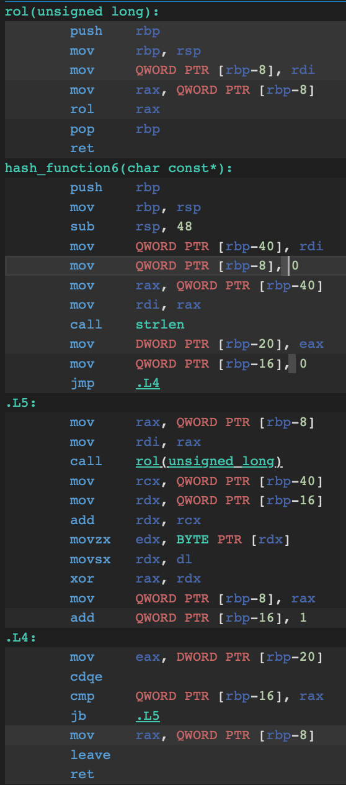

# Хэш-таблица
Тестирование и оптимизация различных версий хэш-функций.

## Содержание

1. [Часть первая](#часть-первая-сравнение-хэш-функций)
    1. [Цель](#цель)
    2. [Реализованные хэш-функции](#реализованные-хэш-функции)
    3. [Эксперимент](#эксперимент)
       1. [Хэш-функция, которая всегда возвращает 1](#1-хэш-функция-которая-всегда-возвращает-1)
       2. [Хэш-функция, которая возвращает ASCII-код первого символа слова](#2-хэш-функция-которая-возвращает-ascii-код-первого-символа-слова)
       3. [Хэш-функция, которая возвращает сумму ASCII-кодов элементов слова](#3-хэш-функция-которая-возвращает-сумму-ascii-кодов-элементов-слова)
       4. [Хэш-функция, которая возвращает длину слова](#4-хэш-функция-которая-возвращает-длину-слова)
       5. [Хеш-функция Ror](#5-хеш-функция-ror)
       6. [Хеш-функция Rol](#6-хеш-функция-rol)
       7. [Хэш-функция Crc32](#7-хэш-функция-crc32)
2. [Часть вторая](#часть-вторая)
3. [Примечание](#примечание)

## Часть первая. Сравнение хэш-функций

#### Цель

Целью данной части является выяснение, как часто происходят коллизии хэша для разных хэш-функций на основе анализа размеров цепочек в хеш-таблице.

Визуализация хэш-таблицы методом цепочек:


#### Входные данные

Используемые входные данные представляют собой произведение "Мастер и Маргарита" Михаила Булгакова, переведенное на английский. Перед использованием текст обрабатывается следующим образом:

- Удаляются знаки препинания;
- Удаляются цифры;
- Буквы приводятся к нижнему регистру.

#### Реализованные хэш-функции

Программа сравнивает семь различных хэш-функций:

1. Возвращает всегда 1;
2. Возвращает сумму ASCII-кодов первого символа строки;
3. Возвращает сумму ASCII-кодов всех символов строки;
4. Возвращает размер слова;
5. Функция хеширования Rol;
6. Функция хеширования Lol;
7. Хэш-функция Crc32.


#### Эксперимент

Для каждой хэш-функции создается хеш-таблица методом цепочек с константным размером 4001. Затем каждое слово из произведения добавляется в хэш-таблицу. В случае коллизии элементы перечисляются в цепочке. Размер каждой цепочки записывается.

#### 1. Хэш-функция, которая всегда возвращает 1

```
key_type hash_func1(const char* key) {
    return 1;
}
```


Эта хэш-функция неэффективна, так как все элементы складываются в один список.

#### 2. Хэш-функция, которая возвращает ASCII-код первого символа слова

```
key_type hash_func2(const char* key) {
    return key[0];
}
```


В приближенном формате:


Эта функция не подходит для эффективного использования хеш-таблицы, так как коллизии происходят слишком часто. Значения хеш-функции не распределены равномерно.

#### 3. Хэш-функция, которая возвращает сумму ASCII-кодов элементов слова

```
key_type hash_func3(const char* key) {
    size_t len = strlen(key);
    size_t sum_ASCII_code = 0;

    for (size_t i = 0; i < len; i++) {
        sum_ASCII_code += (int)key[i];
    }

    return sum_ASCII_code;
}
```


Хэш-функция, основанная на сумме ASCII-кодов элементов слова, проявляет распределение с множеством пиков. Это происходит потому, что каждая буква в слове имеет свой уникальный ASCII-код, и сумма этих кодов зависит от длины слова и порядка букв в нем.

Результаты хэш-функции на размере хэш-таблицы 503


Уменьшая размер хэш-таблицы до 503 получается наложение значений длины списков с 503 до ~1200 на значения от 0 до 502.

#### 4. Хэш-функция, которая возвращает длину слова

```
key_type hash_func4(const char* key) {
    return strlen(key);
}
```


В приближенном формате:


Из данного анализа графика можно сделать вывод, что слова определенных длин встречаются чаще всего. Например, слова длиной 2-10 символов имеют более высокую частоту появления по сравнению со словами другой длины. Однако, с увеличением длины слова количество таких слов снижается, и слова длиной более 15 символов уже становятся редкостью.

Такой подход делает хеш-таблицу менее эффективной, поскольку большинство слов будут хешироваться в ограниченный диапазон индексов таблицы.

К дополнению рассмотрим хэш-функцию, которая возвращает сумму ASCII-кодов элементов слова деленное на длину слова:

```
key_type hash_func4_2(const char* key) {
    size_t len = strlen(key);
    if (len == 0) {
        return 1;
    }

    size_t sum_ASCII_code = 0;
    for (size_t i = 0; i < len; i++) {
        sum_ASCII_code += (int)key[i];
    }

    return (int)(sum_ASCII_code / len);
}
```


В приближенном формате:


Можно заметить, что все значения хешей в диапазоне 90-120. Такое распределение значений хешей указывает на то, что большинство слов имеют близкие значения хешей, что может привести к увеличению количества коллизий.

#### 5. Хеш-функция Ror

Хэш-функция ROR осуществляет циклический сдвиг битов числа вправо. Биты сдвигаются вправо, и биты, выходящие за пределы справа, перемещаются на место самых младших битов числа.

```
inline size_t ror(size_t x) {
    return (x >> 1) | (x << 63);
}

key_type hash_function5(const char* key) {
    size_t ans = 0;
    int len = strlen(key);

    for (size_t i = 0; i < len; i++) {
        ans = ror(ans) ^ (key[i]);
    }

    return ans;
}
```


Визуализация функции ror:


Эта хэш-функция обеспечивает более равномерное распределение данных в диапазоне от 0 до 4001 с максимальными пиками, достигающими 27. Это означает, что значения хэш-кодов, возвращаемые этой функцией, имеют более однородное распределение по всему диапазону значений от 0 до 4001.

#### 6. Хеш-функция Rol

Хэш-функция ROL представляет собой алгоритм хэширования, который осуществляет циклический сдвиг битов числа влево.

```
inline size_t rol(size_t x) {
    return (x << 1) | (x >> 63);
}

key_type hash_function6(const char* key) {
    size_t ans = 0;
    int len = strlen(key);

    for (size_t i = 0; i < len; i++) {
        ans = rol(ans) ^ (key[i]);
    }

    return ans;
}
```


Данная хэш-функция также обеспечивает равномерное распределение данных в диапазоне от 0 до 4001, при этом максимальные пики достигают 16. Это означает, что значения хэш-кодов, возвращаемые этой функцией, распределены более равномерно по всему диапазону значений от 0 до 4001 по сравнению с хэш-функцией ROR.

#### Оптимизация и анализ хэш-функции с использованием операции ROL
Моя хэш-функция использует операцию ROL. ROL позволяет эффективно управлять битами. Оптимизация кода с помощью флага -O3 приводит к существенному сокращению размера исполнения.

Посмотрим на изменений в функции ROL при разных уровнях оптимизации:

<p float="left">
  
  
  
</p>

##### Анализ без оптимизации (-O0):

###### rol(unsigned long):
- Функция сохраняет значение регистра rbp на стеке и копирует в него значение из регистра rdi.
- Выполняется циклический сдвиг rol.
- Функция возвращает значение регистра rax.
- Переход на уровень выше вызывается операциями pop rbp и ret.
###### hash_function6(char const*):
- Функция сохраняет значение регистра rbp на стеке и резервирует место для локальных переменных.
- Получается длина строки key.
- Запускается цикл от 0 до len.
- Вызывается rol для ans.
- К каждому символу key[i] применяется операция xor с результатом rol(ans).
- Возвращается результат ans.

##### Анализ с оптимизацией (-O3):
###### rol(unsigned long):
- В данной версии функции нет сохранения и восстановления регистров.
- Происходит только операция rol, затем возвращается результат.
###### hash_function6(char const*):
- Оптимизация существенно сокращает код за счёт удаления ненужных операций сохранения и восстановления регистров.
- В основном функциональном блоке кода ничего не меняется, кроме отсутствия избыточных операций.

##### Разница оптимизация -O1 и -O3:
- В .L4 блоке сначала выполняется циклический сдвиг rol перед операцией xor.
- В .L5 блоке сначала выполняется операция xor перед циклическим сдвигом rol.

##### Результат оптимизаций
Оптимизация кода с помощью флага -O3 приводит к существенному сокращению размера исполнения. В данном случае, оптимизация в основном затронула функцию rol, делая её более оптимальной. Функция hash_function6 осталась практически неизменной после оптимизации.

#### 7. Хэш-функция Crc32

Хэш-функция CRC32 - это алгоритм хэширования, который широко используется в различных программных приложениях для вычисления контрольной суммы для данных.

Процесс вычисления хэша CRC32 начинается с инициализации начального значения, которое обычно равно 0xFFFFFFFF. Затем каждый байт входных данных последовательно обрабатывается алгоритмом. Для каждого байта применяется XOR с текущим значением CRC, а затем происходит циклический сдвиг бит влево на один бит. Если старший бит CRC становится равным 1 после сдвига, происходит операция XOR с полиномом 0x04C11DB7. Этот процесс повторяется для всех байтов входных данных.

В конце обработки всех байтов CRC инвертируется, и это конечное значение является хешем для входных данных.

Эта хэш-функция хорошо распределяет данные по разным спискам (максимальная длина списка 10).

```
key_type hash_function7(const char* data) {
    int size = strlen(data);
    uint32_t crc = 0xffffffff;

    unsigned char* str = (unsigned char*)data;

	while (size-- !=0) {
        crc = crc_lookup_table[((uint8_t) crc ^ *(str++))] ^ (crc >> 8);
    }
    return ~crc;
}
```


#### Анализ дисперсий хэш-функций

Дисперсия в контексте хэш-функций представляет собой меру равномерности распределения хэш-кодов для различных входных данных. Чем меньше значение дисперсии, тем более равномерно хэш-функция распределяет хэш-коды по всем возможным значениям.

#### Формула для расчета дисперсии:

Для подсчета дисперсии хэш-функции можно использовать следующую формулу:

$$ \text{Дисперсия} = \frac{\sum (x_i - \bar{x})^2}{n} $$

#### Интерпретация:

- Дисперсия показывает, насколько хорошо хэш-функция равномерно распределяет хэш-коды по всем возможным значениям.
- Маленькое значение дисперсии указывает на хорошую равномерность распределения, тогда как большое значение может указывать на неравномерность или сосредоточенность хэш-кодов в определенных областях.

#### Результаты

|         Хэш-функция                           |  Дисперсия |
|:---------------------------------------------:|:----------:|
| всегда возвращает 1                           |    31412   |
| ASCII-код первой буквы                        |    1923    |
| сумма ASCII-кодов букв слова                  |     55     |
| сумма ASCII-кодов букв слова (рамзер HT = 503)|     141    |
| сумма ASCII-кодов букв слова / длина слова    |    3459    |
| длина слова                                   |    3679    |
| rol                                           |     12     |
| lol                                           |      5     |
| CRC32                                         |      3     |

## Часть вторая

## Примечание

Результаты могут варьироваться в зависимости от выбранного текста и размера хеш-таблицы.
